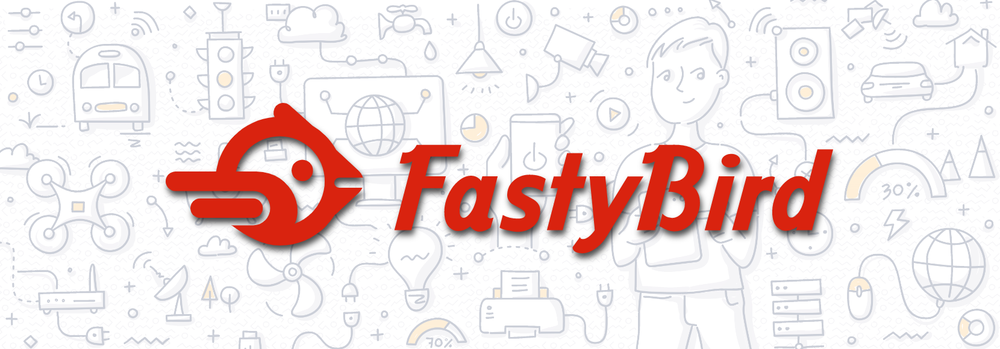

<h1 align="center">FastyBird MiniServer Edition</h1>

<p align="center">This is FastyBird MiniServer Edition repository for starting new projects.</p>

## What is FastyBird IoT MiniServer?

MiniServer is standalone application based on [FastyBird](https://www.fastybird.com) [IoT](https://en.wikipedia.org/wiki/Internet_of_things) software.
The highest quality of code and strong testing culture, make it best solution for build smart controller application.

[FastyBird](https://www.fastybird.com) [IoT](https://en.wikipedia.org/wiki/Internet_of_things) MiniServer is an Apache2 licensed distributed application,
developed on top of the [Nette framework](https://nette.org) and [Symfony framework](https://symfony.com).

### Features:

- Devices & connectors management
- User & access control management
- [{JSON:API}](https://jsonapi.org/) strong api for application management
- Responsive user interface
- Third party devices integration like [Shelly](https://www.shelly.cloud/en-cz), [Tuya](https://www.tuya.com) and other
- Full HomeKit with HAP protocol integration

## Requirements

[FastyBird](https://www.fastybird.com) MiniServer is tested against [PHP](https://www.php.net) 8.1, [Redis](https://redis.io) 6.2 in-memory data store, [MySQL](https://www.mysql.com) relational database management system, [ReactPHP http](https://github.com/reactphp/http) 0.8 event-driven, streaming plaintext HTTP server and [Nette framework](https://nette.org/en/) 3.0 PHP framework for real programmers.

## Getting started

> **NOTE:** If you don't want to install it manually, try [docker image](#install-with-docker)

### Traditional installation

The best way to install **fastybird/miniserver** is using [Composer](https://getcomposer.org/). If you don't have Composer yet, [download it](https://getcomposer.org/download/) following the instructions.
Then use command:

```sh
composer create-project --no-dev fastybird/miniserver path/to/install
```

```sh
cd path/to/install
```

Everything required will be then installed in the provided folder `path/to/install`

#### Running app

You have two options how to run this app

##### Running an app via ReactPHP http server

All what you need is just run one console command:

```sh
vendor/bin/fb-console fb:web-server:start
```

This command will start build in web server which is listening for incoming http api request messages from clients. 

##### Running an app via Apache or Nginx

You have to configure you web server running on [Apache](http://www.apache.org) or [Nginx](https://www.nginx.com) to server content from `public` folder.

In this folder is main entry point for accessing application api.

### Install with docker


Docker image: [fastybird/miniserver](https://hub.docker.com/r/fastybird/miniserver/)

#### Use docker hub image

```bash
docker run -d -it --name devices fastybird/miniserver:latest
```

#### Generate local image

```bash
docker build --tag=miniserver .
```

```sh
docker run -d -it --name miniserver miniserver
```

## Initialization

This application is using database, and need some initial data to be inserted into it. This could be done via shell command:

```sh
vendor/bin/fb-console fb:initialize
```

This console command is interactive and will ask for all required information.

After this steps, application could be started with [server command](#http-server)

## Feedback

Use the [issue tracker](https://github.com/FastyBird/miniserver/issues) for bugs or [mail](mailto:code@fastybird.com) or [Tweet](https://twitter.com/fastybird) us for any idea that can improve the project.

Thank you for testing, reporting and contributing.

## Changelog

For release info check [release page](https://github.com/FastyBird/miniserver/releases)

## Maintainers

<table>
	<tbody>
		<tr>
			<td align="center">
				<a href="https://github.com/akadlec">
					
				</a>
				<br>
				<a href="https://github.com/akadlec">Adam Kadlec</a>
			</td>
		</tr>
	</tbody>
</table>

***
Homepage [https://www.fastybird.com](https://www.fastybird.com) and repository [https://github.com/fastybird/miniserver](https://github.com/fastybird/miniserver).
